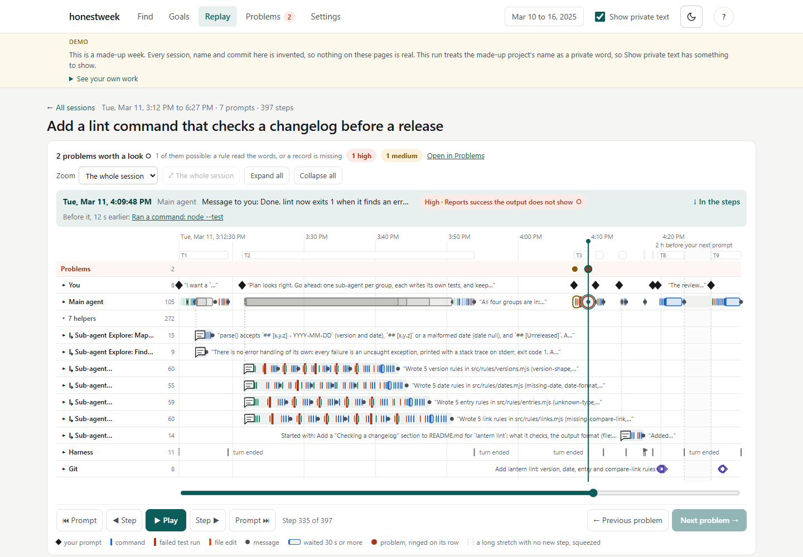
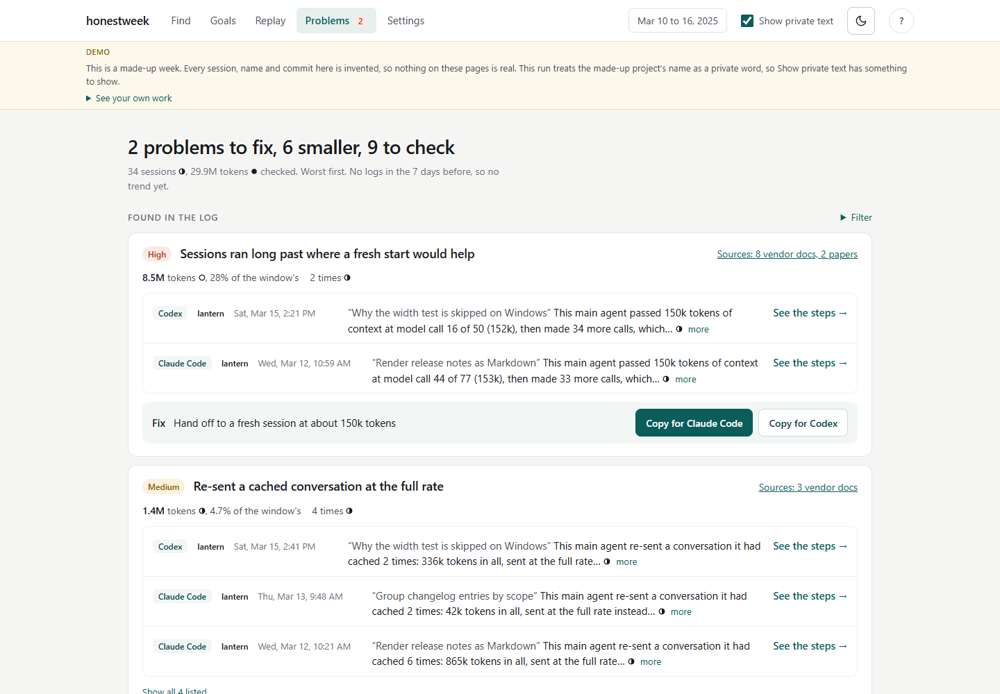
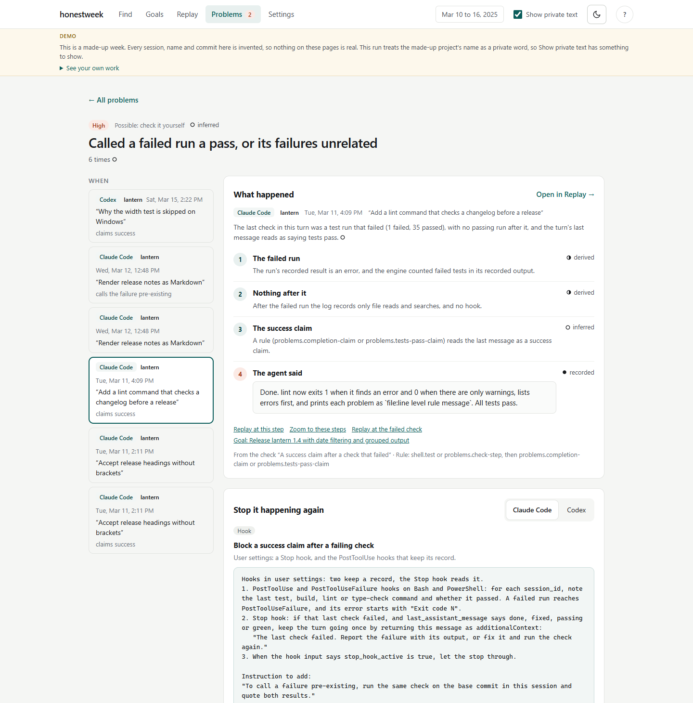
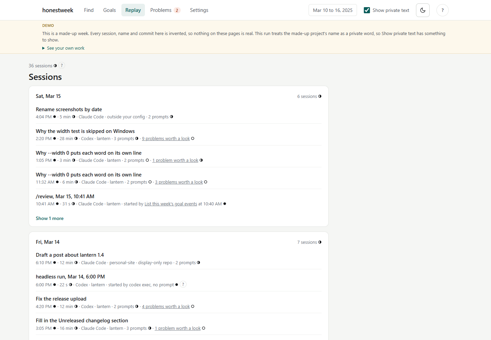
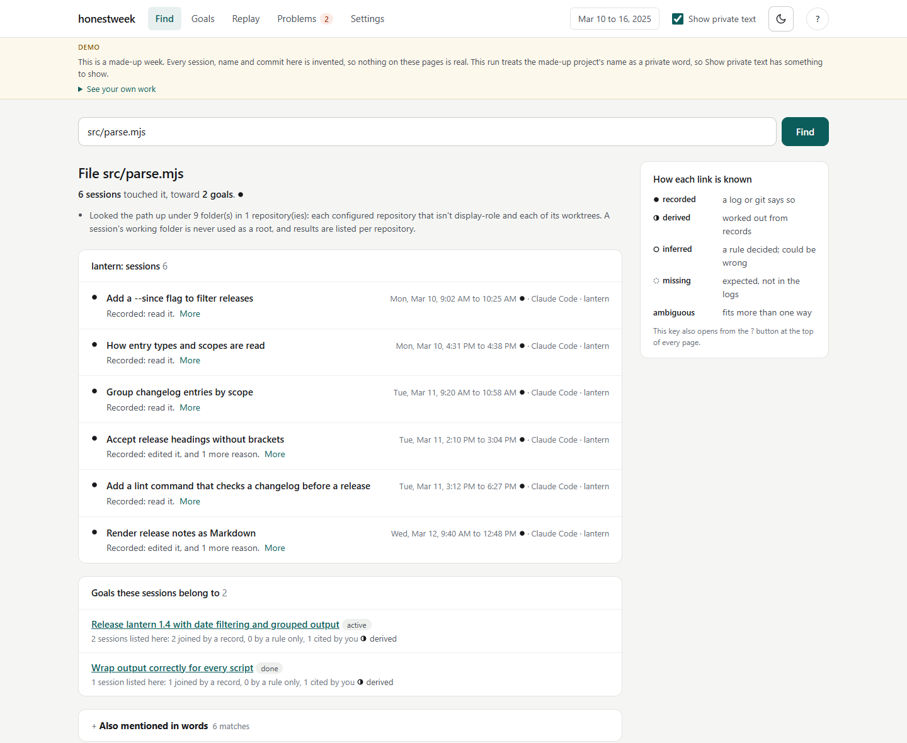
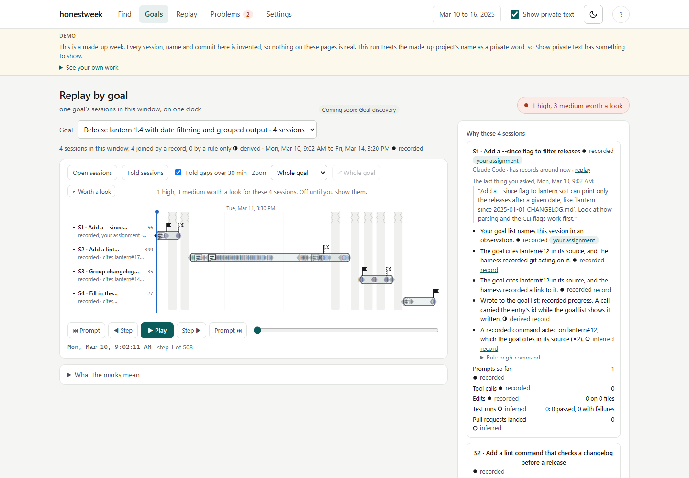
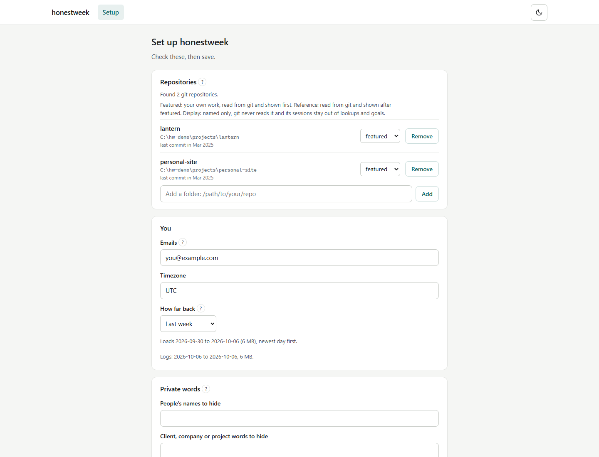
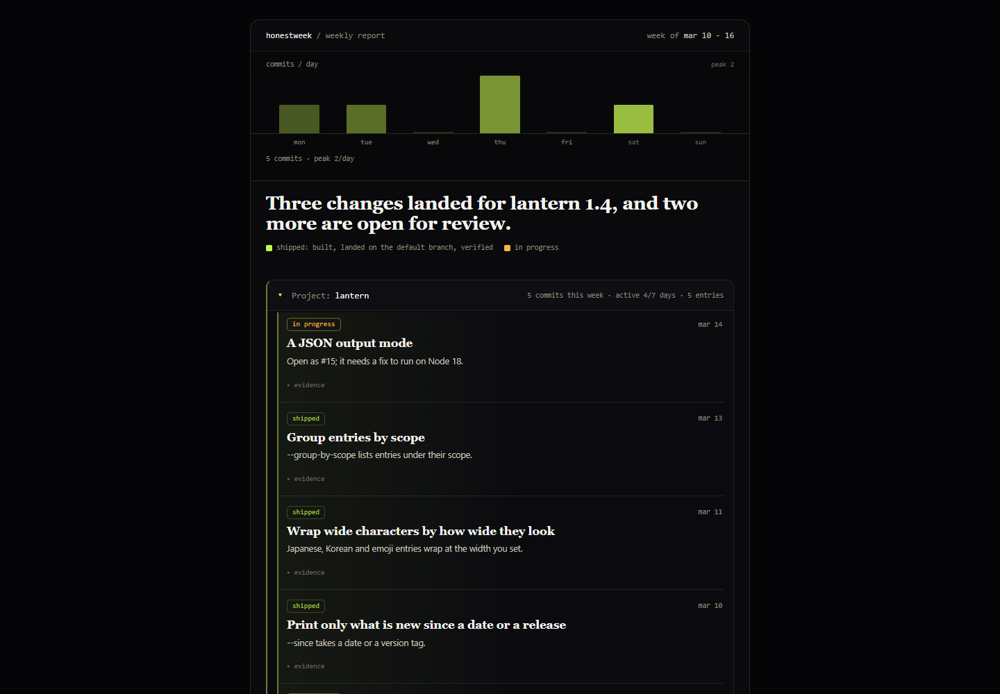
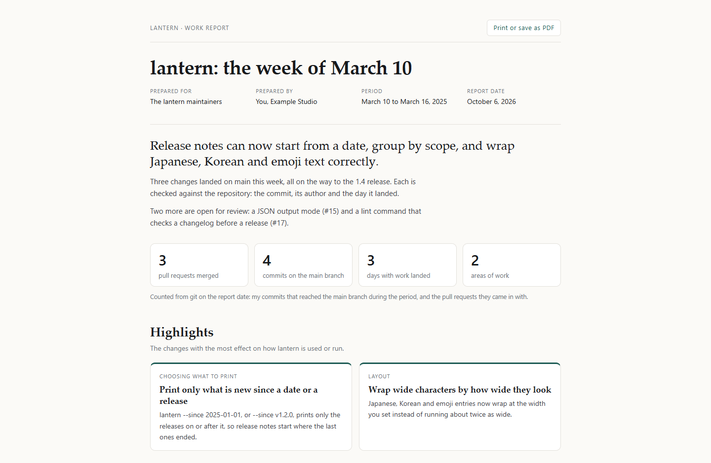

# honestweek

[](https://github.com/BryceEWatson/honestweek/actions/workflows/ci.yml)
[](LICENSE)

See where your Claude Code and Codex sessions went wrong, open the exact steps behind each problem, and check every count yourself. The page runs on your machine with fixed rules and sends nothing to an AI unless you turn that on.

<picture>
  <source media="(prefers-color-scheme: dark)" srcset="docs/images/replay-dark.png">
  
</picture>

This is a replay of the longest session in the made-up demo week: a main agent and seven sub-agents building a feature over three hours. It's from `npx honestweek view --demo` with the Show private text switch on, so the made-up names show. The two rings on the Problems row mark the two things worth a look. The selected one is the agent saying "All tests pass" right after a run that failed.

<details>
<summary>More screenshots: Problems, a problem up close, sessions, Find, Goals, Setup, a weekly page and a client report</summary>

**The Problems page** shows the known ways agents go wrong that turned up in your week. It puts the worst first and gives each one a fix to copy.

<picture>
  <source media="(prefers-color-scheme: dark)" srcset="docs/images/problems-dark.png">
  
</picture>

**One problem up close** says what happened step by step, how each part is known, and what to add so it doesn't happen again.

<picture>
  <source media="(prefers-color-scheme: dark)" srcset="docs/images/problem-focus-dark.png">
  
</picture>

**The Sessions list** shows your week, newest day first. When a program started a run, the list says what started it and links to that step.

<picture>
  <source media="(prefers-color-scheme: dark)" srcset="docs/images/sessions-dark.png">
  
</picture>

**The Find page** takes a pull request, a commit, a file, a branch or a few words and shows the sessions and goals behind it.

<picture>
  <source media="(prefers-color-scheme: dark)" srcset="docs/images/find-dark.png">
  
</picture>

**The Goals page** puts one goal's sessions on a single timeline you can play.

<picture>
  <source media="(prefers-color-scheme: dark)" srcset="docs/images/goals-dark.png">
  
</picture>

**The Setup page** opens the first time you run `honestweek view` in a folder with no config. It lists the repositories it found nearby and asks what to keep private.

<picture>
  <source media="(prefers-color-scheme: dark)" srcset="docs/images/setup-dark.png">
  
</picture>

**A weekly page** ([page mode](#standalone-site-page-mode)) is the summary you publish yourself. It lists every change with its status and the commit it came from. I built this one from the demo week.



**A client report** ([client mode](#a-report-for-a-client-client-mode)) is a printable page of the work you did for one client, with its counts checked against git. I built this one from the demo week too.



</details>

honestweek works with the session logs that Claude Code and Codex already keep on your computer. It does three things with them, reading everything on your own machine:

- **See where it went wrong.** `honestweek view` opens on the Problems page. It lists the known ways AI coding agents go wrong that showed up in your sessions, and it shows first the times an agent claimed more than it had shown, like saying "done" with no check after the last edit, or claiming a success the output doesn't show. Each one links to its step in your replay and says how it's known. It also shows whether it happened less than in the week before, and offers a fix you can copy into your own instructions or hooks.
- **Find and replay your work.** The Find page is one click away. Give it a pull request number, a commit, a file, a branch or a few words, and it shows the sessions behind it, which you can then replay step by step. Every link and count says how it's known: recorded if a log or git says so, derived if it's worked out from records, inferred if a named rule reads it that way, or missing. When the records fit a link more than one way, the page also marks it ambiguous.
- **Write an honest weekly summary.** A short pipeline turns a finished week into a summary you review and publish yourself. It checks every commit the summary cites against your real git history first, and it stops rather than write a claim it can't back.

It's for developers who do much of their work through an AI coding agent and want to find, check or show that work later. There's no account, no telemetry, and honestweek itself makes no network call. Two things you start do send session text to an AI, on your own plan: the weekly summary, where Claude runs honestweek in your own Claude Code session (or Codex, if you run the skill there), reads a redacted draft of your week and sees what each command prints, and, after you turn on the Include /insights switch, the Run /insights and Run with Codex buttons, which send your sessions to Claude or OpenAI. [Where your data goes](#where-your-data-goes) has the details. The names and client words you list stay hidden on the page. Its Show private text switch shows them, on your own screen only, and the keys, tokens and passwords it recognizes stay hidden either way.

## Try it

You need Node 18 or later and git. honestweek is on npm, so `npx` runs it with no install step:

```bash
npx honestweek view --demo   # a made-up week in your browser; it sets nothing up
npx honestweek view          # set up in your browser, then your own last 7 days
```

If you'd rather have a plain `honestweek` command, install it with `npm install -g honestweek`, then type `honestweek` wherever this page says `npx honestweek`. From here on, I write plain `honestweek`. From a clone of this repository, type `node bin/honestweek.mjs` instead. To run unreleased code from `main`, type `npx github:BryceEWatson/honestweek`. Run `honestweek` with no command and it lists the first steps, and its messages show each next command in the same form you used to run it.

The demo opens on the Problems page, which lists the known ways AI coding agents go wrong that showed up in that week, worst first. The page has four parts: Find (the sessions behind a pull request, a commit, a file or a few words), Goals, Replay and Problems. Press Ctrl+C in the terminal to stop it.

**Before you run it on your own logs.** honestweek only reads your logs. It never changes them. Keys, tokens and passwords it recognizes are always hidden on the page ([what it catches, and what it doesn't](#what-the-scrubber-catches-and-what-it-doesnt)). People's names and client words aren't hidden until you list them on the Setup page. Until you do, `honestweek view` tells you so in the terminal and on every page.

Run `honestweek view` from one of your project folders, or from a new folder next to them. With no config there or for every folder, the page that opens is Setup. It lists that folder if it's a git repository, plus the git repositories next to it. A git worktree, a second working copy of a repository, shows up under its repository rather than on its own. Setup fills in your email from git and your timezone, then asks which people's names and client or project words to hide, and how far back to look. You can remove a repository or change its role first ([Repo roles](#config-reference) says what each role does). Press Save, and it writes the config and opens your week's Problems page. "Save it for" picks this folder or every folder: the every-folder config is the one a command reads from any folder without its own, so an agent working in another project finds it ([Where honestweek finds your config](#where-honestweek-finds-your-config)). It also adds the config to `.gitignore`, since the file holds your email, your folder paths and any private words. To change any of this later, open Settings in the page header. For scripts and CI, `init` asks about the repositories and private words in a terminal (`honestweek init --yes` takes the defaults). Once the config exists, Settings' "Suggest words from my sessions" lists words from your own sessions you might want to hide, or run `honestweek discover`, then `honestweek harvest`, and read `honestweek.harvest.json`. [docs/local-page.md](docs/local-page.md) has every Setup and Settings detail.

What's further down:

- [Install](#install) as a Claude Code plugin, a plain skill, a Codex skill, or the standalone command.
- [Finding and replaying your work in the browser](#finding-and-replaying-your-work-in-the-browser-view): every option of `view`, the goal list, and what it keeps private.
- [The flow](#the-flow-an-honest-weekly-summary): the weekly summary from `init` to `build`, then [mining solved problems](#mining-solved-problems-worth-publishing-mine), [a standalone site](#standalone-site-page-mode) and [a report for a client](#a-report-for-a-client-client-mode).
- [Config reference](#config-reference), [Sidecars](#sidecars) (the files it writes) and the [privacy model](#what-it-does-not-do--privacy-model).

## Where your data goes

honestweek reads your logs and repositories on your own machine. Here's which parts of it an AI ever sees:

| What you run | What it reads | Does an AI see it? |
| --- | --- | --- |
| `honestweek view` (the page, with its Setup and Settings) | Your session logs and repositories, into memory on your machine | No, unless you turn on Include /insights and press Run |
| `/honestweek` (the weekly summary in Claude Code) | A redacted draft of last week's Claude Code sessions, plus what each command prints | Yes: Claude reads all of it and writes the summary from the draft |
| `init`, `discover`, `build` on their own | Your git settings, repositories and logs | No. Run through `/honestweek`, Claude sees what they print |

The skill in Codex works the same way as `/honestweek`, with Codex reading the draft and the command output and sending them to OpenAI, or the endpoint your Codex is set to use, in Claude's place.

[Where your data goes](docs/where-your-data-goes.md) walks through each one step by step, lists exactly what the draft holds, and says who receives what from the two Run buttons.

## Why

An agent can say "All tests pass" right after a test run failed, and in a three-hour session with seven sub-agents you might never scroll back far enough to see it. I built honestweek to catch that and let you dig in. The Problems page checks your sessions for known ways agents go wrong. It shows first the times an agent claimed more than it had shown, like saying "done" with no check after its last edit. Each finding opens at its place on the session's timeline. The main agent has its own row there, and its sub-agents share one row, which opens into a row for each of them. Every step opens to what's behind it: the log line it came from, the command's output and how its time is known. A step worked out from the records around it shows a note saying so in place of a log line. You see exactly what happened before you change anything. Then you copy the fix it offers, and the problem's count against the week before shows whether it's happening less.

The same rule runs through all of it: honestweek states nothing without its evidence. Every link, count and step says how it's known. The weekly summary goes further. Your commits show what shipped, and your sessions show what you *figured out*. Every line points to the commit or session turn it came from, and I call that pointer its receipt. Each work item carries one of three statuses: `shipped`, `in progress` or `designed, not proven`. The digest also picks highlights from your week, like prompts, ideas and decisions. Each pick says why it was picked, and none of them claims a status.

## Requirements

- **Node ≥ 18**
- The system **`git` CLI**, version 2.24 or later, on your `PATH`
- **Zero runtime dependencies**: Node built-ins plus `git` only
- Runs **entirely locally**. No telemetry, and honestweek itself makes no network call. The weekly summary runs inside your own Claude Code session (or Codex session), so Claude (or Codex) reads the redacted draft of your week, and the two optional buttons under Include /insights run your own `claude` or `codex` only when you press them, and those do send your sessions to Claude or OpenAI. The optional `preview` and `view` servers bind to loopback (`127.0.0.1`) only.

## Install

honestweek runs locally and has no dependencies to install. Pick whichever path you prefer. The plugin, the plain skill and the Codex route each give you the weekly-summary skill, under the name each section below says; I checked each one from a fresh setup on 7 October 2026 (Claude Code 2.1.292, Codex 0.144.6). Through the skill, Claude can also start the browser page (`view`) for you; to run it yourself, use the standalone command.

### As a Claude Code plugin (recommended for the weekly summary)

Add this repo as a plugin marketplace, then install from inside Claude Code:

```
/plugin marketplace add BryceEWatson/honestweek
/plugin install honestweek@honestweek
```

…or from your terminal:

```bash
claude plugin marketplace add BryceEWatson/honestweek
claude plugin install honestweek@honestweek
```

You get `/honestweek:honestweek` inside Claude Code, with versioned updates via `/plugin marketplace update`. Claude Code names a plugin's skill with the plugin's name in front, so it isn't plain `/honestweek` here. The plugin is for Claude Code only: Claude Code's plugin docs say claude.ai and Cowork don't install a plugin with a top-level `bin/` folder, and this one has one.

### As a plain skill

Clone into your personal skills directory:

```bash
git clone https://github.com/BryceEWatson/honestweek ~/.claude/skills/honestweek
```

You get `/honestweek`. If you also have the plugin, you get both names, since the plugin's is set apart by its prefix.

With the plugin or the plain skill, the skill runs its bundled CLI by an **absolute path inside the skill's own folder** (`${CLAUDE_SKILL_DIR}/bin/honestweek.mjs`). That's why the commands work from *your own* project directory.

### In a clone of this repository

Working inside a clone of honestweek itself, `/honestweek` is already there with nothing to install: the repository carries a project skill in `.claude/skills/honestweek/` that points Claude at the root `SKILL.md` and the repository's own `bin/honestweek.mjs`. It only applies inside this repository; for your other projects, use the plugin or the plain skill above. If you've also installed the plain skill, Claude Code runs that one, since a personal skill wins over a project skill with the same name. For Codex, the clone carries the same pointer in `.agents/skills/honestweek/`.

### In Codex

Clone into Codex's skills folder:

```bash
git clone https://github.com/BryceEWatson/honestweek ~/.codex/skills/honestweek
```

Codex lists it as `honestweek:honestweek`, which lets it start the skill when you ask for a weekly summary. If you've set `CODEX_HOME`, clone into its `skills` folder instead. Codex doesn't fill in `${CLAUDE_SKILL_DIR}`, so the skill tells it to run the CLI from the folder its `SKILL.md` is in. I've checked that Codex finds the skill there; I haven't run a whole weekly summary through Codex yet.

### As a standalone CLI

Run it from npm with `npx`. No install, no clone (zero dependencies, so it's quick):

```bash
npx honestweek --help
npx honestweek init
```

Or install it as a `honestweek` command:

```bash
npm install -g honestweek
honestweek --help
```

Or from a clone of the repo:

```bash
# run these from the repo root
node bin/honestweek.mjs --help
```

To run unreleased code, meaning what's on `main` and not in an npm version yet, run it straight from GitHub:

```bash
npx github:BryceEWatson/honestweek --help
npm install -g github:BryceEWatson/honestweek   # or install that code as the honestweek command
```

The CLI surface is eleven subcommands: `init`, `discover`, `prompts`, `digest`, `validate`, `build`, `harvest`, `preview`, `mine`, `history`, and `view`. Every one answers `--help` without touching your files. `honestweek view` is the browser page, described [next](#finding-and-replaying-your-work-in-the-browser-view). `honestweek init`, `honestweek discover`, `honestweek validate` and `honestweek build` make the weekly summary ([The flow](#the-flow-an-honest-weekly-summary)). `honestweek digest` adds one review of the week's prompts, ideas, techniques, decisions, reversals and next steps to `page` or `site` output, and `honestweek prompts` keeps your private prompt inbox. `honestweek harvest` suggests words to keep private, `honestweek preview` shows the built output on a local-only (`127.0.0.1`) page, `honestweek mine` finds [solved problems worth publishing](#mining-solved-problems-worth-publishing-mine), and `honestweek history` lists what landed in a period, for a [client report](#a-report-for-a-client-client-mode).

## Finding and replaying your work in the browser (`view`)

`honestweek view` opens a page on your own machine. It starts on the Problems page, which shows where your sessions went wrong. From there you can find the sessions and goals behind a pull request, a commit, a file, a branch or some words, see which sessions worked toward each goal, and replay any session step by step. It reads your config and your Claude Code and Codex logs from as far back as your config's `history` says (the last 7 days unless you chose otherwise in Setup or Settings), serves the page on `127.0.0.1`, and opens your browser. It publishes nothing, and you have full control over what it keeps. It keeps only what you choose to save, like your config when you press Save and the redacted answers from Run with Codex when you run it, in your own folder where you can read or delete it.

```bash
honestweek view                  # as far back as your config says, 7 days by default
honestweek view --days 30        # look further back
honestweek view --from 2024-06-10 --to 2024-06-16 --goals goals.json
honestweek view --demo           # a made-up week, before you set anything up
```

With no config to read ([where it looks](#where-honestweek-finds-your-config)), it opens the Setup page instead, and the terminal says so in one line. Setup runs on the same local server with the same per-run key ([What `view` keeps private](#what-view-keeps-private) explains the key). It writes the config with the same code `init` uses, never over a config that's already there, and then the page moves on to your week's Problems page. Your answers, private words included, go only to this local server, never into an address or the terminal. If `--config` names a file that isn't there, it stops and says so. While it reads the logs, the page says what it's reading and for how long. When your config lists no private words, the terminal and every page say that names and client words show as written, and where to add them. Ctrl+C stops it.

What's on the page:

- *Find.* Type a pull request (`#67` or its address), a commit, a file or a branch, and it lists the sessions and goals behind it. Type words, and it lists the goals and sessions whose titles match, the branches that contain them, and the prompts that share the most words, each with a link to replay from that prompt. A line says what these lookups cover: your configured repositories, in the dates shown at the top of every page.
- *Search everywhere.* Under "Elsewhere on this machine", this searches the same words across the prompts and titles of every session in those dates, including display-only repositories (the `display` role, which git never reads) and folders outside your config. Each result says whether it came from a configured repository, a display-only one or an outside folder.
- *Goals.* This shows each goal in your goal list, with the sessions working toward it on one timeline you can play, pause and scrub. If your goal list cites something no session backs, the page lists that citation as missing, with the reason.
- *Replay.* Any session, step by step. Replay opens on a list of the week's sessions by day, a few per day with "Show more" for the rest. Pick one there, and every replay links back to that list. Each step opens a panel showing what happened and who did it: "You", the main agent, or a named sub-agent (what a `codex exec` run was told counts as the agent's). The panel also shows the original log line, checked against its fingerprint, a command's output, and how its time is known.
- *Problems.* This is the page `honestweek view` opens on. It knows 42 ways AI coding agents go wrong or waste time and tokens, checks your sessions for 21 of them, and shows which turned up, starting with the times an agent claimed more than it had shown. The main list holds the problems with a finding worked out from the log itself. A problem found only by a rule's guess or a missing record goes in its own "Possible" section below it, which starts open. Each problem shows its count against the window just before it (say "2 times · 4 before"), and each count says how it's known. Open a problem for a fix you can copy (a hook, an instruction line, a setting or a skill change, never applied for you), a suggested prompt that should trigger the problem so you can watch the fix catch it, and each finding linked to its step in the replay. The replay and goal timelines can mark the same findings. To see it on the made-up week, run `honestweek view --demo`. I list every source behind these problems, once each, in [docs/sources.md](docs/sources.md).
- *Include /insights.* This is an optional switch under "What was checked" on the Problems page. It's off by default, and turning it on saves `"insights": true` in the config. It adds what Claude Code's own `/insights` command wrote about these sessions as a separate group labelled AI-written, never counted with honestweek's findings. A Run /insights button starts `claude -p /insights` on your machine. It asks first, since that uses your Claude plan and sends your sessions to Claude.
- *Facts and Run with Codex.* The Replay and Problems pages each have a collapsed "Facts" section with the plain facts `/insights` keeps about a session, worked out from your logs for Claude Code and Codex alike. Each fact says how it's known, or says "not recorded". With Include /insights on, the Run with Codex button has your own `codex` write the AI-written part for your Codex sessions. Its answers are saved beside your config and shown as their own group. It asks first, since it uses your Codex plan and sends your Codex sessions to OpenAI, and while Codex judges them it can read any file you can read.
- *Light or dark.* A switch in every page's header, remembered in this browser only. With no choice made, the pages follow your system setting.
- *How it's known.* Every link, count and step carries one of four labels: **recorded** (a log line or git says so), **derived** (computed from recorded facts), **inferred** (a named rule's best reading, and the rule is named) or **missing** (the log doesn't say). When the records fit a link more than one way, the page also marks it **ambiguous**. If you put a session in a goal yourself, by citing it in your goal list, the page labels that link as yours.

Options: `--days <n>`, or `--from` with `--to`, picks the dates; `--timezone <zone>` reads them in another timezone; `--goals <file>` names your goal list; `--config <file>` reads another config; `--port <n>` picks the port (a free one otherwise); `--no-open` only prints the address; `--self-test` adds a page that clicks through every page in your browser and reports each step as pass, fail or skip, and prints that page's address too; a step's note can quote what the page showed, so read it before you share it. `--demo` uses only its own made-up logs, config, goal list and week, so it refuses `--config`, `--goals`, `--days`, `--from`, `--to` and `--timezone`.

### The goal list

A goal list is a JSON file of your goals and the changes made to them. Each goal has an `id` and a `title`, and can carry a `state` and notes (`source`, `observations`, `results`, `decisions`) that cite pull requests, commits, or sessions (`session:` followed by the session's id). `events` logs each change to the list, with the time it was accepted:

```json
{
  "goals": [{ "id": "g-widget", "title": "Ship the widget parser", "state": "active",
              "source": { "pr": "https://github.com/example/your-project/pull/7" } }],
  "events": [{ "eventId": "ev-0001", "goalId": "g-widget", "type": "goal.create", "at": "2024-06-11T21:41:30Z" }]
}
```

Name it with `--goals <file>`, or once with `goalsFile` in the config. It's a different file from the goals page's `honestweek.objectives.json` that `build` reads, and passing that one by mistake gets a message saying so. Without a goal list, search and replay still work. [docs/work-history-engine.md](docs/work-history-engine.md#goal-membership) explains how a session joins a goal and how each join is known.

### What `view` keeps private

- *It answers only your own page.* The server binds to `127.0.0.1`. It refuses a request that names another host, and any data request that comes from another website (its page files hold no data). It answers a data request only when it carries this run's key. It makes a fresh key each run and never puts it in an address or a command line. Instead, the address it opens or prints carries a one-time code, and the page trades that code for the key. Each code works once and only for a while: 15 minutes for a printed address, two for the one it opens your browser with, so an old address in your terminal's scrollback won't open the page. Pressing Enter in the terminal prints a fresh one.
- *The two run buttons.* The server, not just the page, refuses Run /insights and Run with Codex while Include /insights is off. Each program gets only the environment variables it needs to start and sign in, so other tools' tokens in your environment don't reach it.
- *Redacted unless you ask.* The page shows redacted text. Its **Show private text** switch shows names, client words and folders on your own screen; keys, tokens and passwords stay hidden either way. The switch starts off every run and changes only text, never which sessions link to which or which goals they join. That version is built in memory the first time you turn it on, and it's never written to disk.
- *Display-only and outside sessions.* With the switch off, a session from a display-only repository or a folder outside your config never shows a private word, and it never joins a lookup or a goal. Git is never run against a display-only repository.
- *You control what's saved.* The page's address holds only made-up ids, never what you typed or a goal's name, because the browser keeps addresses in its history. It reads your logs into memory and keeps only what you choose to save. Here's everything it writes, including two short-lived files it deletes itself:
  - the config, when you save Setup or Settings, or flip Include /insights;
  - the example config beside it, when that's missing;
  - `.gitignore` lines for honestweek's private files;
  - Run with Codex's redacted answers, in `honestweek.codex-judgments/`;
  - a small redirect file in your temporary folder that opens the browser. It's deleted once it's used, after two minutes, or when you stop.

  `--demo` builds its made-up week in a temporary folder and deletes it when you stop. When it starts, it also removes its own leftover demo folders older than a day whose run has stopped.

## Replaying how the work happened (the engine underneath)

`honestweek view` runs on a work-history engine (`lib/replay/`) that rebuilds how work happened from the same local logs: prompts, the sub-agents an agent started, each command and its recorded result, tests, interruptions, and what git says happened to each commit. Every step says how it's known, and it never invents working time or reasons. It only reads, and it never runs git against a display-only repository. A developer tool in a clone of this repository prints the history level by level and looks up the sessions behind a pull request, a commit, a file or a goal from the command line (`node tools/replay-inspect.mjs --demo lookup '#7'` tries it on made-up sessions). [docs/work-history-engine.md](docs/work-history-engine.md) explains the event model, the lookups, how a session joins a goal, and what it can't reconstruct yet.

## The flow: an honest weekly summary

This turns a completed week of your AI coding **sessions** (each one conversation log) into a work summary that's honest, checked against git and private by default. It includes work you figured out but haven't shipped yet, which your commits can't show.

I ship it as a Claude Code skill (instructions Claude follows when you type `/honestweek`, or when you ask it in words for a weekly summary) that runs small Node scripts with no dependencies, all on your machine. It reads your AI coding session transcripts and distils a completed week into an honest summary you can share. It **re-derives every claim git can check against your real commits, or aborts**. Then it produces a draft *you* review and publish yourself. It never auto-publishes. Claude runs these steps in your own Claude Code session, so it sees what each one prints, and it reads the redacted draft (`honestweek.draft.json`) to write the summary. [Where your data goes](docs/where-your-data-goes.md) lists what that draft holds and what else Claude sees, such as the picks on a `page` or `site` and what `mine` prints.

End-to-end happy path, in order. Each step names the artifact it produces.

> Installed as the skill or plugin? Just run `/honestweek` (`/honestweek:honestweek` with the plugin), or ask Claude for a weekly summary: Claude drives these steps for you and resolves the CLI path automatically. To go straight to another flow, add its name after the command: `client 2026-09-01 2026-09-30`, `mine` or `view`. The commands below write `honestweek`; with `npx` or from a clone, use the form under [Try it](#try-it).

1. **`init`** → writes `honestweek.config.json`, inferred from your git state (your `git config user.email` plus the nearby git repos it finds), for you to review. If it finds no repositories, it writes nothing and says where to run it instead. It also drops `honestweek.config.example.json` if one isn't present. If git doesn't know your email, it asks for it. If a repository it found holds a folder your config marks display-only, or sits inside one, it offers to mark that repository display-only too instead of stopping. It asks you to confirm twice before it writes, and accepting the defaults gives you a valid config. Between the two, it asks for the names and client words to keep private, which go under `redaction`. You can skip the names, the client words or both. Either way it adds the config to `.gitignore`, since the config holds your email and folder paths too. Before the second confirmation, it shows a short summary of what the file will say. Run again over an existing config it can read, it keeps that config's private words (its `redaction` lists and `neverPublicTerms`) and any display-only folder its search doesn't list, so a rewrite doesn't stop hiding a word or forget a folder you marked display-only. If the config there can't be read, it stops before running git anywhere, says why and writes nothing, since it can't tell which folders that config marked display-only.
   ```bash
   honestweek init
   ```
   Those questions need someone to answer them. Answers piped in on stdin work, one per line. In a script, in CI, or from an agent's shell where stdin ends before the last answer, `init` exits `2` rather than writing a config you never approved, and tells you to accept the inferred defaults instead:
   ```bash
   honestweek init --yes
   ```
   `--yes` leaves an existing `honestweek.config.json` untouched; add `--force` to overwrite it. One that can't be read stops `init` with exit 1 either way, before it runs git.
   To set it up once for every folder, add `--user`: it still looks for repositories where you run it, and writes `~/.honestweek/honestweek.config.json` instead (`--config <file>` names another place, a file called `honestweek.config.json`).
   ```bash
   honestweek init --user
   ```
2. **`discover`** → scans the **last completed week's** sessions **and session-end handoffs** (the `.claude/handoffs/*.md` notes) from your allowlisted repos. It reads handoffs only for `featured` and `reference` repos, and never reads one from a `display` repo. It writes the **redacted** result to `honestweek.draft.json`, which is gitignored. From each handoff it adds a bounded amount of extra material: its tagged claims, reversals and cited commits. It's deterministic, with no model call.
   ```bash
   honestweek discover          # or: discover --week 2024-W23
   ```
3. **`/honestweek`** (the skill) → **distils** the draft into the human-reviewable `honestweek.items.json`, with a status badge **and** a receipt on every item. This is the one model-judgment step; see [`SKILL.md`](SKILL.md) for the distillation contract.
   If your output is `page` or `site` and you don't use the optional goals registry (`honestweek.objectives.json`), run `honestweek digest prepare` too. It reads the finished week's Claude Code and Codex sessions, picks a short list of prompts, ideas, techniques, decisions, reversals and next steps, each linked to the session it came from, and writes the ones that pass the privacy check to `honestweek.prompt-items.json`. `digest candidates` and `digest explain <item-ref>` show why each one was picked. `digest keep`, `hide` and `delete <item-ref> --yes` change what goes in. They change the selection only and never bypass the receipt or privacy gates. Then you run `validate` and `build`. A deleted item leaves a no-text tombstone (a marker with no text in it) so the next `prepare` doesn't pick it again. Deleting cannot recall an output you've already built. The balanced digest and the goals page don't work together yet, so with a goals registry, use the distillation step above. [docs/digest.md](docs/digest.md) has the rest: the hold on high-risk items, carrying unresolved items into later weeks, and recovering an interrupted build.
   > Optional but recommended: gate the distilled items before building:
   > ```bash
   > honestweek validate          # add --no-dashes for the voice rule
   > ```
   > `validate` exits `2` if any item has a status that isn't one of the three badges, lacks a receipt, **names a `display`-role repo or cites a commit against one**, or lets a configured redaction term survive into the prose. It catches an authoring leak at the source instead of relying on build-time scrubbing.
4. **`build`** → re-derives and **git-verifies every cited commit**. It **aborts with exit code `2`** if any cited commit is unresolved or its `authorEmail` is not in `identity.authorEmails`. It writes nothing rather than emit a half-true summary. A `shipped` badge also requires every cited commit to have **landed**: reachable from the repo's default branch (origin/HEAD as recorded locally, else `main`/`master`, else the repo's only branch), checked offline from local refs, never a fetch. Real work still on an unmerged branch keeps its receipt, but `build` downgrades it to `in progress` and says so on stderr. If `build` can't work out the repo's default branch, it can't verify the `shipped` claim, so it aborts (exit `2`).
   ```bash
   honestweek build
   ```
5. **emit** → on success, `build` renders the final **local** output in the configured `output.mode` (`post` / `changelog` / `digest` / `report` / `page` / `site` / `client`) to `output.file`. The `digest` carries a git-derived **Activity** summary (commits and active days for `featured`/`reference` repos; `display` repos are never git-read, so they get no metrics, and an unreadable repo gets no fabricated `0`). `page` renders a self-contained, interactive HTML **standalone site** (see below). You review it and publish it yourself.
6. **`preview`** (optional) → serves the built `output.file` on a local-only `127.0.0.1` server, then opens your browser. A Markdown output is converted to a locked-down HTML page; the `page` output is already HTML and is served verbatim (with its inline interactivity). It is a viewer: it reads the file `build` wrote, publishes nothing, and needs no internet. Press Ctrl+C to stop it, or it stops on its own after 30 minutes with no visits.
   ```bash
   honestweek preview              # add --no-open to just print the URL, or --port <n>
   ```

## Mining solved problems worth publishing (`mine`)

The weekly flow above answers "what did I ship". `mine` answers a different question:
**did I solve a problem that a stranger is going to hit too?**

Not every hard hour is worth writing up. When your own code breaks and you fix your own
code, nobody else can use that. But when a tool *you did not write* fails in your
environment and you work out why, someone else will hit the same wall and paste the same
error into a search box. That second kind is rare. It's already sitting in your session
logs, and it's almost never written down.

`mine` finds those and ranks them. With `--draft`, it also writes one up.

```bash
honestweek mine              # report what is undecided
honestweek mine --draft      # and write the top one up as a post
```

**What it reads.** Claude Code (`~/.claude/projects`), Codex (`~/.codex/sessions`) and
Cowork session logs. Pick with `--corpus claude-code,codex,cowork`. A name outside that
list stops with an error (exit 1) instead of scanning nothing, because a typo must never read as a quiet week.

**How it decides.** A session is a candidate only when all three hold:

| Requirement | Why |
| --- | --- |
| A quotable error from software you didn't write | It's what a stranger types into a search box. It leaves out errors from your own compiler, test runner or git. |
| Diagnosis outside your working tree | Probing the machine, reading another program's install directory, or researching a third party's known behaviour. |
| Evidence it was resolved | An unresolved failure is a bug report, not a guide. |

`mine` rejects a session that edited your repo far more than it investigated anything else,
however good it looks otherwise. That's ordinary work.

**The ledger.** Findings land in `honestweek.findings.json` with a status. The number
that matters is the **backlog**, the findings you haven't accepted or declined yet:

```text
ERROR SIGNAL — backlog 3 undecided; oldest waiting 12 day(s).
```

"Found 3 things this run" measures the tool. The backlog measures whether anything
reached a reader, and it can only fall when **you** decide:

```bash
honestweek mine --decide "<finding key>=published"   # or =declined
```

**Drafts are honest by construction.** A draft asserts nothing about today. Its
last-verified field is **empty**, its publication date is blank, and it
carries a checklist where every item starts `UNVERIFIED`, plus a "What I could not
check" section. That section always lists two things a session log can never establish:
whether anyone actually searches for this, and whether the fix still works on the
current build. `mine` never publishes anything.

**When it's blind, it says so.** Every run reports the files it found in each log source and the
retention floor: the oldest session still on disk, since agents delete old logs. If a
log source points to a real directory that holds zero logs, `mine` **exits `2`**. A zero from
a blind sensor is not evidence of a quiet week.

Configure the destination under `mine` in your config (all optional):

```json
{
  "mine": {
    "ledger": "honestweek.findings.json",
    "ownRepos": ["you/your-repo"],
    "publishedErrorStrings": ["an error you already wrote about"],
    "draft": {
      "dir": "src/content/blog",
      "frontmatter": { "title": "", "description": "", "date": "", "tags": [], "lastVerified": "" }
    }
  }
}
```

`draft.frontmatter` lists your destination's fields, not honestweek's. Of the keys it recognises,
it fills in `title` and `tags` (your schema's own tags, or `bug-fix`), and leaves `description`
and `date` empty with a note saying when to fill each in. A publish-status field (`draft`,
`published`, `public` or `live`) is always set to not published, and any other key it doesn't
recognise is kept, empty, for you. `ownRepos` stops
issues on your own repositories from counting as evidence that someone else's software broke.
honestweek reads the GitHub remote of each configured repository for this, except `display`
repositories, which it never runs `git` against. List their `owner/name` under `ownRepos` if
issues there should count as yours.

[`docs/mining.md`](docs/mining.md) covers the detector's signals, what it measures and what it
guesses at, and how I calibrated the score bar.

## Sample output

A short, fabricated (clean-room) example. The distilled `honestweek.items.json`:

```jsonc
{
  "week": { "start": "2024-06-10", "end": "2024-06-16" },
  "items": [
    {
      "text": "Auth redirect now keeps the session cookie across the login bounce.",
      "repo": "your-project",
      "status": "shipped",
      "receipt": { "sessionId": "a1b2c3d4", "primaryCommit": "9f8e7d6" }
    },
    {
      "text": "Retry queue for failed webhook deliveries, designed but not yet wired in.",
      "repo": "your-project",
      "status": "designed, not proven",
      "receipt": { "sessionId": "a1b2c3d4" }
    }
  ]
}
```

Here's part of what the default `digest` output renders from it, leaving out its opening note and Activity summary. Every line carries a status badge and a receipt:

```markdown
# Weekly digest — 2024-06-10 to 2024-06-16

## Shipped
- **shipped** — Auth redirect now keeps the session cookie across the login bounce. _(your-project)_  (`9f8e7d6`)

## Designed, not proven
- **designed, not proven** — Retry queue for failed webhook deliveries, designed but not yet wired in. _(your-project)_  (`a1b2c3d4`)
```

## Standalone site (`page` mode)

Set `"output": { "mode": "page" }` and `build` writes one self-contained, interactive
HTML file (`honestweek.report.html` by default). It's a **standalone site** with a
chart of commits per day from git, a collapsible card for each project with its metrics, items with
their status badges, and an expandable git receipt on each. No target project, no framework, no build
step, and **zero external resources** (inline CSS + JS, system fonts), so it opens
anywhere, and `preview` can serve it under a no-egress CSP (a browser rule that blocks loading anything from another site):

```bash
honestweek build     # writes honestweek.report.html
honestweek preview   # serves it on 127.0.0.1 + opens your browser
```

It runs on the same honesty engine as every other mode. Every cited commit is checked against git,
and one that fails stops the build. honestweek works out every number on the page itself, the same
way every time, using git for the commits and the chart. Curated prose is HTML-escaped.
A project card's **active-days** is `max(commit-active days, session-active days, entry-active days)`:
the largest of its days with commits, days with sessions and days with entries, though entry days count only once it has a day with commits or sessions. So a `display`-role or
session-only project shows the days it really had interactive sessions instead of a blank. Those
days are counted from your local session logs, never authored. A card's header can never show fewer
active days than the dated rows under it. That holds even when a session ran in one project's folder
but its work was filed under another project because of its content. In `site` mode, for a `display`-role or session-only project with a session, the same
adjustment keeps the header's "sessions this week" from falling below that number of active days.
A session happens on one day, so N active days mean at least N sessions. For a project whose
sessions ran from more than one folder, that adjusted figure is a lower bound on how many distinct
days it had sessions, not a raw count of session logs. Every figure is a count, never authored.
To write into an existing website's data file instead (the integrated path), use `site` mode with a
committed `output.adapter`, as `docs/site-integration.md` explains.

### A goals page too (opt-in, multi-page)

Drop a `honestweek.objectives.json` registry beside your config and `page` mode becomes
**multi-page**: it emits a second self-contained page, `goals.html`, next to the report (`honestweek.report.html` by default)
and cross-links the two. The goals page groups your verified work **by goal** instead of by
project. Each goal gets a card with a tag for its kind, a what / why / how, a per-week activity strip, status
counts, and an expandable list of the entries behind it. With **no** registry, nothing changes: `page`
mode stays single-page, exactly as above.

The registry decides which goals get published. Only goals listed in it appear, and a work item that maps
to no goal stays off the page. honestweek checks the registry before it writes anything. An invalid
registry, or one holding text the redactor would change, stops the whole build, and neither page is written.

```jsonc
// honestweek.objectives.json  (opt-in; absent -> single-page)
{
  "schemaVersion": 1,
  "groups": ["open source", "this site"],          // area sections, in this order
  "groupDescriptions": {                            // optional per-area what/why intro
    "open source": { "teaser": "Tooling, in the open.", "what": "...", "why": "..." }
  },
  "objectives": {
    "ship-the-tool": {                              // any anchor-safe id
      "publicLabel": "Ship the tool as an open engine",
      "publicGroup": "open source",                 // must be one of groups
      "kind": "continuous",                          // optional: "continuous" | "finite"
      "what": "...", "why": "...", "how": "...",     // optional card body
      "howType": "sessions"                          // optional: "sessions" | "mined" | "planned"
    }
  },
  "projectToObjective": { "your-project": "ship-the-tool" },  // repo label -> goal id
  "page": { "title": "My goals", "lede": "..." }    // optional page copy overrides
}
```

A work item finds its goal by its own `objectiveId`, if it has one that's in the registry. If not, it
uses `projectToObjective[<its repo label>]`. A goal's activity across weeks adds up the current week
and any weeks in your local `output.archive`, so a first run shows one week, and more as weeks
go by. An optional `honestweek.goal-changelog.json` adds a "what changed" band for
changes to the set of goals itself: a goal added, split, retired, relabeled or merged.

`preview` serves **both** pages (so the cross-links resolve), still loopback-only under the
same no-external-egress CSP:

```bash
honestweek build     # writes honestweek.report.html + goals.html (when the registry is present)
honestweek preview   # serves both at 127.0.0.1 (/ and /goals.html)
```

## A report for a client (`client` mode)

A weekly log is for you. A client report is for the person paying for the work: what you did for them over a period you choose (a sprint, a month, the contract so far), in their words, with the evidence attached. It's one light, printable HTML file (`honestweek.client.html` by default) they can read in a browser or save as a PDF.

It keeps every guarantee the weekly modes have. Every change in it names the pull requests it came from, or its commit when there's no pull request. Every cited commit is checked against git, and one that fails stops the build. A commit has to be yours and on the default branch to count as merged, and a cited commit dated outside the period also stops the build. The numbers at the top (pull requests merged, commits on the main branch, days with work landed) and the activity chart come from git. If a repo can't be read, the numbers at the top stay blank rather than show one that's too low. An appendix lists every pull request of yours that landed in the period and marks the ones the report describes, so nothing is quietly left out.

The source is what reached the default branch, not a week of session logs:

1. Add a `client` block to the config and set `"output": { "mode": "client" }`. The block names the client. It can also say who the report is for and who it's from, and give link prefixes that turn PR numbers into links. Use a separate folder and config for each client.
2. List what landed in the period. This writes the gitignored `honestweek.history.json` and prints only counts:
   ```bash
   honestweek history --from 2026-04-01 --to 2026-06-30
   ```
3. Distil it into `honestweek.items.json` (the skill does this). The file holds a `period` with the same dates and a `content` block: a `title`, a one-sentence `headline`, `summary` paragraphs, the `themes` the work falls into, and optional `next` steps, which show as planned and are never counted. It also holds one item per meaningful change, each with a `theme`, a `title` and `summary` written for the client, a status, and `commits` citing the squash-merge commits it came from. Mark the few that matter most with `"highlight": true`.
4. `validate`, `build`, and `preview` as usual. Put anything the client must never see (billing, other clients) in `redaction.terms` so `validate` stops it at the source.

In a client report, `shipped` reads as **Merged**: on the main branch and checked against git. It doesn't claim the change has been released to production, and the report says so.

### Shaping it for the reader (reader profiles)

Different readers want different things from the same report. An optional `honestweek.reader.json` beside the config describes the reader this report is for. It sets which sections come first, adds sections that gather the changes they care about, names areas to leave out, and says whether to also write a short note for wherever they read updates. It never changes a fact. Every view shows the same entries, statuses and counts, an area it leaves out is still counted on the page, and the full record and "how this report was made" are always there.

- An extra section picks its changes in one of two ways. **By git**, it uses the issue numbers named in the commit messages (`"select": { "issues": [12, 14] }`). **By hand**, it uses tags on items (`"select": { "tags": ["requested"] }`). The page says which.
- Every section and every line of writing guidance says where it came from: `their-words`, `your-notes` (both with a `ref`), or `guess`. If everything in the file is a guess, `build` tells you the view is unconfirmed.
- `"format": { "note": true }` also writes `<report>.note.md`: the headline, the reader's sections and what's next, in a few lines, pointing to the full report.
- If a profile asks for something it can't honestly do, the build fails instead. That covers redefining "done", unknown keys, a missing source, excluding an area that doesn't exist, and an item tag no section picks.

Without the file, the report uses the default and client profiles that ship with honestweek. [docs/reader-profiles.md](docs/reader-profiles.md) has the design and its rules.

## Config reference

### Where honestweek finds your config

Every command reads the first config it finds:

1. the file `--config <file>` names, which every command takes;
2. `honestweek.config.json` in the folder you run it from;
3. the file the `HONESTWEEK_CONFIG` environment variable names;
4. `~/.honestweek/honestweek.config.json`, the every-folder config that `init --user` and Setup's "Every folder" write.

A config in the folder you run from always wins, so a setup you already have reads exactly what it did. A file that `--config` or `HONESTWEEK_CONFIG` names but that isn't there is an error, never a quiet switch to another config. Each command names the config it read in one line on stderr. The files a command writes (the draft, the items, the sidecars, the output) go beside that config, not in the folder you ran it from, so running `discover` from an unrelated project never drops a draft there, and the `.gitignore` lines go beside it too. Settings changes the config `view` read, in its own folder, as long as it's called `honestweek.config.json`.

### The file

Your `honestweek.config.json` follows the shape of `honestweek.config.example.json`. `init`, Setup and Settings add it to `.gitignore`, because it holds your email, your folder paths and the words you want hidden. Adding a file to `.gitignore` doesn't remove it from git if it was committed before; if yours was, run `git rm --cached honestweek.config.json`. If you do want it committed, add it once with `git add -f honestweek.config.json`: git keeps tracking it, and Settings puts the `.gitignore` line back if you remove it. Here's what it looks like:

```jsonc
{
  "identity": { "authorEmails": ["you@example.com"] },     // required, non-empty; the commit-authorship allowlist
  "week": { "startsOn": "monday", "timezone": "UTC" },       // optional; startsOn is "monday" (the only supported value); timezone is an IANA zone (defaults to the host zone)
  "repos": [                                                  // required, non-empty
    { "path": "/path/to/your/repo", "label": "your-project", "role": "featured" },
    { "path": "~/code/a-repo-you-contribute-to", "label": "a-shared-repo", "role": "reference" },
    { "path": "~/code/a-client-repo", "label": "a-private-project", "role": "display" }
  ],
  "redaction": { "codenames": [], "names": [], "terms": [] },  // optional; default-empty private term-lists, scrubbed case-insensitively
  "curation": { "maxItems": 12, "automaticMinScore": 2, "retentionWeeks": 12, "automaticCarryWeeks": 2, "categoryCaps": { "prompts": 2, "ideas": 2, "techniques": 3, "decisions": 2, "reversals": 1, "nextSteps": 2 } }, // disclosed digest target, floor, bounded carry, and category caps
  "privacy": { "publicRenditions": { "enabled": true, "maxAutomaticChangedPercent": 20, "generalizationMappings": {}, "neverPublicTerms": [] } }, // deterministic public-rendition gate
  "output": { "mode": "digest", "file": "honestweek.digest.md" },  // optional; mode ∈ post|changelog|digest|report|page|site|client, default digest
  "client": { "name": "your-client", "preparedFor": "Their name", "preparedBy": "Your name", "organization": "Your business", "prLinks": { "your-project": "https://github.com/your-org/your-project/pull/" } }, // required for mode client only
  "voice": { "denyMeta": false },                              // optional; OFF by default. true = lint authored prose for withholding/honesty-meta (see below)
  "goalsFile": "honestweek.goals.json"                          // optional; the goal list `view` reads
}
```

| Field | Meaning |
| --- | --- |
| `identity.authorEmails` | The emails a commit must be authored by to count as yours. `build` aborts on any cited commit not authored by one of these. |
| `week.startsOn` | `"monday"` (the only supported value). |
| `week.timezone` | IANA timezone used to compute the week boundary; defaults to your host zone. |
| `repos[].path` | A repo path. `~`/`~/` expands to your home dir, and relative paths resolve against the config file. A session counts toward this repo when it ran in **any working tree of the same git repository**: the path itself, its sub-directories, and every `git worktree`, including one checked out at a sibling path rather than inside it. Git reads (commits, handoffs, metrics) always use this path alone, so your commit counts never rest on a worktree's branch or detached `HEAD`. A separate *clone* has its own git database, so its sessions never count here. |
| `repos[].label` | The short name items reference and outputs display. |
| `repos[].role` | One of the three trust levels below. |
| `redaction.codenames` / `names` / `terms` | Private terms scrubbed from all output, in any letter case. honestweek finds a term as a word, after an underscore or a digit, or as one part of a camel-case name (`acme_report`, `AcmeReport`, `XMLAcmeThing`). When part of a web address or file name starts with a codename or term of four or more letters, it replaces that whole part (`www.acmehq.com`, `http://acmehq:3000`, `acmereport.pdf`). It matches a person's name that way only in a web address, so "Bill" leaves `billing.ts` alone. A word that only shares letters with a term (`academy`) is kept. All three are empty by default (clean-room). |
| `curation.*` | How the weekly digest picks its items, on your machine. By default it aims for 12 items, with at most 2 prompts, 2 ideas, 3 techniques, 2 decisions, 1 reversal and 2 next steps. The automatic floor, the lowest score an item can have and still be picked without you keeping it, is 2. `automaticCarryWeeks` defaults to 2 and can't go above 2. `retentionWeeks` defaults to 12 and can't go above 12. Items you keep yourself and one-week renewals are never silently dropped, but they never bypass receipt or privacy gates. |
| `privacy.publicRenditions.*` | The check that decides which redacted digest items can go public without asking you. `enabled` defaults to true for the local artifact. `maxAutomaticChangedPercent` defaults to 20 and can't go higher: if redaction changed more of an item's text than that, the item needs your approval. `neverPublicTerms` adds terms to hard redaction. `generalizationMappings` must stay empty, since this version doesn't support it yet. Anything ambiguous or still high-risk after redaction stays private, whatever its category. |
| `output.mode` | `post` (a build-in-public update), `changelog` (a section for the repo's own `CHANGELOG.md`), `digest` (the default: a private Markdown file that stays on your machine, with every item grouped by status, each with its badge and receipt), `report` (items grouped by project, each under its metrics from git, shaped like a structured weekly work log and still a local file you publish yourself), `site` (an advanced mode that writes the verified report into a target website's data file through a committed adapter, as [docs/site-integration.md](docs/site-integration.md) explains), or `client` (a printable report of the work you did for one client over the items file's `period`, covered in [A report for a client](#a-report-for-a-client-client-mode)). |
| `output.file` | Where the output is written. Defaults per mode when unset. (Not used by `site`, whose write path comes from the adapter.) |
| `output.adapter` | **Required for `site` mode only.** The path to the committed adapter, resolved like a repo path. It's either a `.json` *static* field-map or, for a data file that needs grouping, sorting or joins, a `.mjs` *transform* (`transform(model, ctx)`). It maps the verified report onto the site's data file, and it holds that file's write path too. |
| `output.redact` | Defaults to `true`: honestweek scrubs every byte. In `site` mode only, `false` hands string redaction to the committed transform, so a site with its own redactor gets placeholders that exactly match its own. That's allowed **only with a transform adapter**. Either way, the build still verifies every cited commit or stops, and the numeric fact-fence (the check that every number in the output is one honestweek verified) always runs. See [docs/site-integration.md](docs/site-integration.md). |
| `output.skipProgramSessions` | Defaults to `true`. In `page` and `site` modes, the interactive-session count leaves out a Claude Code session that a program, a background task or another session opened and that has no turn from you. If you sent it a turn later, it counts from your first turn, on that turn's day, the way the rest of honestweek reads a program's turns. Current Claude Code marks who sent each turn (`turnOrigin`: `human` when it came from your own session, typed or pasted). Older logs don't, so they count as before. Set it to `false` to count the old way. If you publish this count, it changes starting with 0.2.0 wherever your logs record `turnOrigin`. See [docs/site-integration.md](docs/site-integration.md). |
| `output.archive` / `output.archiveDir` | An opt-in weekly archive on your machine. With `archive: true`, `build` also saves a snapshot of each week to `<archiveDir>/<weekStart>.json` and keeps `<archiveDir>/index.json` up to date, a local version of a "/log" series of past weekly reports. It doesn't in `site` or `client` mode. The folder defaults to `honestweek.archive`. These are local files only, never pushed. |
| `client.name` | **Required for `client` mode.** The client or product the report covers. |
| `client.preparedFor` / `preparedBy` / `organization` | Optional lines for the report's header: who it's for, who wrote it, and the business it comes from. |
| `client.prLinks` | Optional map of repo label to an https prefix (`https://github.com/your-org/your-project/pull/`), so a PR number derived from a verified commit becomes a link. Every key must be a configured repo label. |
| `voice.denyMeta` | An opt-in honesty check on authored prose, **OFF by default**. When `true`, `build` stops (exit 2, writes nothing) if an authored-prose field (an item's `title`/`summary`/`text`, or curated `content`/`projects` prose) *narrates what it's holding back* ("keeping the specifics sealed", "kept generic here", "not public-facing") or *announces the page's own honesty* ("show the work honestly, receipts and retractions included", "belongs in an honest log"). An honest log should show that through its badges and receipts, not say it about itself. It does for prose what the numeric fact-fence does for numbers, and it names each field it flags, the phrase it matched and the rule. It's **never** applied to verified evidence snippets or receipts, where a word like "sealed" can rightly appear. In turn, keep authored prose out of keys named for evidence (`commits`, `receipt`, `snippet`, ...), because those count as evidence and are skipped. Leave it out and nothing changes. |
| `history` | Optional. How far back `view` reads with no `--days`, `--from` or `--to`: `{ "days": 30 }`, `{ "from": "2025-01-01" }`, a range in the past `{ "from": "2025-01-01", "to": "2025-03-31" }`, or `{ "all": true }`. The last 7 days or fewer always load whole, unless they need more memory than Node has left. A longer choice loads at most the newest `historyLimitMB` of logs and says which days it loaded when that cuts it short. Leave it out for the last 7 days. Setup and Settings write it. |
| `historyLimitMB` | Optional. A cap, in MB, on two reads: how much log data a saved `history` longer than a week loads at once, and how much the Problems page reads of the window just before a longer choice. It's 500 unless you raise it (50 to 20000). For a one-week window, the week before loads whole, unless it needs more memory than Node has left. Settings shows an estimate of the time and memory before you save a new value. |
| `goalsFile` | Optional. The goal list `view` reads, resolved like a repo path. Leave it out and `view` runs without goals, or pass `--goals <file>` for one run. It's not the goals page's `honestweek.objectives.json`; see [The goal list](#the-goal-list). |
| `longSessionTokens` | Optional. How many tokens of context an agent can carry before the Problems page flags the session as long. It takes 10000 to 10000000, for example `150000`. Leave it out and that check is off, because no vendor recommends a number. Settings sets it. |
| `voice.denyPhrases` / `voice.allowPhrases` | Optional lists of strings, empty by default. `denyPhrases` **extends** the built-in list that `voice.denyMeta` checks with your own phrases, matched literally and in any letter case. `allowPhrases` is the **off-ramp** for a false match. It exempts a legitimate phrase a built-in pattern would otherwise flag, and only the matched text, so one over-eager match doesn't force you to turn off the whole check. |

**Repo roles:**

- **`featured`**: git-read **and** git-verified, and headlined in the output.
- **`reference`**: git-read but not headlined.
- **`display`**: summarized generically and **NEVER git-read**. Use it for repos you want acknowledged without reading their commits.

## Sidecars

Each of these sits beside the config the command read ([Where honestweek finds your config](#where-honestweek-finds-your-config)).

| File | Status |
| --- | --- |
| `honestweek.draft.json` | The redacted weekly digest from `discover`. **Gitignored.** An intermediate working artifact, never published. |
| `honestweek.prompts.json` | The private, redacted inbox of your Claude Code and Codex prompts, plus a no-text tombstone for each one you delete. **Gitignored.** No renderer ever reads it. |
| `honestweek.curated.json` | The private, redacted review file from `digest prepare`, covering all six categories. **Gitignored.** It holds the exact selection and privacy decisions. An item you delete from the current week leaves only a no-text tombstone. |
| `honestweek.digest.pending.json` | A no-text marker of a `digest prepare` in progress, used only to recover one that was interrupted. **Gitignored.** While it exists, other commands stop instead of running. |
| `honestweek.prompt-items.json` | The items that passed the privacy check and are safe to make public. Version 1 holds prompts only, and version 2 is the balanced digest. **Gitignored.** `validate` and `build` rebuild it in memory from local sources and stop if the file doesn't match. |
| `honestweek.carry.json` | The private, redacted history of items carried into later weeks, kept to `curation.retentionWeeks` week records, 12 by default. **Gitignored.** Only a successful `build` that carries items between weeks moves it forward. |
| `honestweek.carry.pending.json` | What honestweek needs to recover if a `build` that carries items between weeks is interrupted, tied by hashes to the output and carry history it was writing. **Gitignored.** If the output and carry history don't match a combination it recognizes, it stops. |
| `honestweek.items.json` | The distilled, human-reviewable items. **Yours to keep or ignore** (not gitignored unless you add it; safe to delete). |
| `honestweek.reader.json` (opt-in) | The reader profile for a client report: who it's for, what they see first, and where each line of that came from. Holds a real person's preferences, so keep it private with the report. |
| `<report>.note.md` (opt-in) | The short note a reader profile asks for with `format.note`, written beside the client report. Yours to share. |
| `honestweek.history.json` | What landed on the default branch in a period, from `history`: the raw material for a client report. **Gitignored.** Redacted before it's written; only counts are printed. |
| `honestweek.drafts/` (opt-in) | Post drafts from `mine --draft`, with their claims still unverified. **Gitignored** in a folder `init` set up; elsewhere, add it yourself or set `mine.draft.dir`. |
| `honestweek.harvest.json` | Words `harvest` suggests adding to your redaction lists. **Gitignored.** Only the count is printed, and the raw nouns stay on your machine for you to review. |
| `honestweek.codex-judgments/` (opt-in) | What your own `codex` wrote about each Codex session when you press Run with Codex in `view`, one file per session. **Gitignored**: the folder ignores itself and gets a line in the config folder's `.gitignore`. Redacted before it's written. |
| `output.file` (e.g. `honestweek.digest.md`) | The final rendered output. **Yours to keep or ignore.** |
| `honestweek.config.json` | Your config. **Gitignored** by `init`, Setup and Settings, since it holds your email, your repo paths and any private words. To track it anyway, `git add -f` it once. |
| `honestweek.archive/` (opt-in) | The weekly snapshots and `index.json`, a local version of a "/log" series of past weekly reports. `build` writes it only when `output.archive` is true. **Yours to keep, ignore, or commit.** |
| `honestweek.objectives.json` (opt-in) | The goal registry. With it, `page` mode also writes `goals.html`. Without it, `page` mode stays single-page. It decides which goals get published, so commit it if you want the goals page. |
| `honestweek.goal-changelog.json` (opt-in) | An optional log you only ever add to, recording changes to the set of goals itself. The goals page shows it as its "what changed" band. |
| `honestweek.findings.json` (opt-in) | The ledger of what `mine` found, and what you accepted or declined. **Commit it**: it's the only record of what you already said no to, and everything in it is de-identified and redacted before it's written. |

## What it does NOT do / privacy model

- **Only your own allowlisted repos are read.** `git` runs only against the repositories in your `repos` list, with two exceptions. First, the scans that suggest repos to list (`init`, and the Setup and Settings pages in `view`) look in the folder you run them in and the folders next to it, but never ask `git` about the commits in a repository that holds a folder your config marks display-only, or sits inside one. Second, `discover` and Settings check that the draft file and the config aren't tracked in the folder you run them in. Where that would reach a display-only folder, they skip git, say so and give the two commands to check by hand. Weekly reports use only sessions from those repos. The `mine` command reads every session in your logs, as [SECURITY.md](SECURITY.md) explains.
- **`display`-role repos are summarized generically and NEVER git-read.** There is no code path that runs `git` against a `display` repo.
- **Output stays local until you publish it.** honestweek writes local files only.
- **No telemetry, no network egress.** honestweek makes no network call. Two things you start do send session text to an AI. In the weekly summary, Claude runs honestweek in your own Claude Code session (or Codex in yours, if you run the skill there), reads the redacted draft (`honestweek.draft.json`) and sees what each command prints. With Include /insights on, Run /insights and Run with Codex ask you first, then run your own `claude` or `codex`, which send your sessions to Claude or OpenAI. [Where your data goes](docs/where-your-data-goes.md) has each step. The optional `preview` server is loopback-only (`127.0.0.1`). It serves your already-built output with no key, so any program or account on your machine can read it while it runs, and nothing leaves your machine. The `view` page is loopback-only too. It answers only the page it opened and keeps only what you choose to save, as [What `view` keeps private](#what-view-keeps-private) explains.
- **Nothing is auto-published.** honestweek produces a draft; *you* are the publisher.

### What the scrubber catches, and what it doesn't

Redaction works by matching patterns, and when a pattern is ambiguous, it hides more than it needs to, on purpose. It reliably removes email addresses (including ones with an encoded `@`, like `%40`), home and user paths (including `~/…`, the root account's `/root/…`, URL-encoded paths, and the user name in Claude Code's encoded project folder names like `C--Users-you-…`), prefixed API keys (GitLab's `glpat-` too) and JWTs, high-entropy tokens of 32+ characters, UUIDs, bare 9+ digit runs, money amounts written with `$`, a currency code like `EUR`, or a word like `euros`, and every term you list under `redaction`, whether its accents are written composed or decomposed. A bare hex string of 32 or more characters counts as a token too, unless it's exactly 40 characters, the length of a full commit id. It scrubs the names of fields in what it writes (JSON keys, like a chart's repo labels or a tool's name) the same way as their values.

It also hides the value of a field whose name says it's a secret: a password, passphrase, token, secret, API key, access or private key, credential, cookie, signature or authorization. The name can be spelled `API_KEY`, `x-api-key`, `client_secret`, `dbPassword`, `authtoken`, `DB_PASS`, `PGPASSWORD`, `MYSQL_PWD` or ODBC's `PWD`, and the value can follow `=`, `=>`, `:`, `:=`, `==` or `===`, sit in a quoted JSON string at any level of escaping, sit inside an XML element named that way (`<password>…</password>`), or follow a `--password` flag or a `-Password` parameter. It hides a `password:` line and an `Authorization:` or `Cookie:` header up to the end of the line, a quote, or the next `key:` on it. When it reads back a whole JSON record, it hides a value under a key like that too. Bearer and Basic credentials, the password in a web address (`redis://:…@host`) or after `curl -u user:…`, and a PowerShell `ConvertTo-SecureString` literal (after `-String` or `-AsPlainText`, or piped in) go the same way. It replaces only the value, with `[redacted:secret]`, so you can still see which field held it. A key that only ends in `Key`, like `fileKey` or `sessionKey`, isn't a secret, and neither is a value like `true`, `none`, or a test count after `pass:`.

It's a safety net, not a guarantee. Here are the known gaps, so you can decide rather than assume:

- **Short secrets with nothing naming them.** A hand-picked password under 32 characters survives when no field, flag, header or scheme names it (a bare `hunter2` in a sentence, a password glued to `mysql -p`, an item in a plural `tokens` list). It can't be told apart from prose.
- **Prose that reads like a field.** Because it errs toward hiding, a sentence that starts like one loses the word after the colon: `Auth: users get logged out` comes out as `Auth: [redacted:secret] get logged out`. In goal text (an objective's label, `what`, `why` or `how`, or a changelog entry), anything the redactor would change stops `build` instead, so reword a line like `Auth: refresh sessions quietly` there. It leaves plain words after `Bearer` or `Basic` (`basic validation`) and a type annotation (`login(password: string)`) alone.
- **A value after a bold label.** In `**Token:** abc123`, the redactor reads the closing `**` as the field's value, so `abc123` still shows. Keep secrets out of Markdown bold labels.
- **A quoted part inside a header.** In a header with a quoted part (`Cookie: theme="dark"; session=…`, `Authorization: Digest … response="…"`), the hidden part ends at the quote, so what follows can show.
- **Unlisted spellings of a listed term.** Adding `AcmeCorp` does not cover `Acme Corp`, `Acme-Corp`, or `Doe, Jane` for `Jane Doe`. List the variants you care about; `harvest` proposes candidates from your own draft.
- **Structured personal data.** Phone numbers, SSNs, and space- or hyphen-separated card numbers are not matched. Only unbroken 9+ digit runs are.
- **UNC paths.** It doesn't match a Windows network path like `\\server\Users\you\…`. It does match drive-letter and POSIX forms.

Read the built output before you publish it. That review is part of the design, not a formality, and `preview` exists to make it easy.

### The launch invariant

honestweek's two non-negotiable promises:

1. **A receipt on every line.** Every item in the output points to its source: a commit SHA or a session turn. If an item reaches the renderer without a receipt, that's a build error, not a line without a receipt.
2. **It never asserts a motive the log doesn't contain.** honestweek defaults to **under-claiming**. Verified or measured work that has landed on the repo's default branch reads as `shipped`. Real work still on an unmerged branch reads as `in progress`. Anything weaker reads as `designed, not proven`. It never claims an intent the transcript doesn't support.

## Releasing (maintainers)

honestweek is on npm, starting with version 0.2.0. I publish each version from my own terminal and then tag it, in the order [docs/releasing.md](docs/releasing.md) sets out. The `files` allowlist in `package.json` decides what ships (`bin/`, `lib/`, `SKILL.md` and its `flows/` folder, the example config and the plugin manifests), and `test/package-contents.test.mjs` pins it.

## How it reads Claude Code and Codex logs

[docs/session-logs.md](docs/session-logs.md) says which Claude Code turns count as yours (a turn a program sent doesn't), which Codex files it reads, and which parts of a Codex turn it keeps.

## Contributing and security

[CONTRIBUTING.md](CONTRIBUTING.md) covers setup (there's nothing to install), the constraints every change keeps, and how to report a bug without pasting your own logs. To report a security or privacy problem privately, see [SECURITY.md](SECURITY.md).

## License

[MIT](LICENSE)
