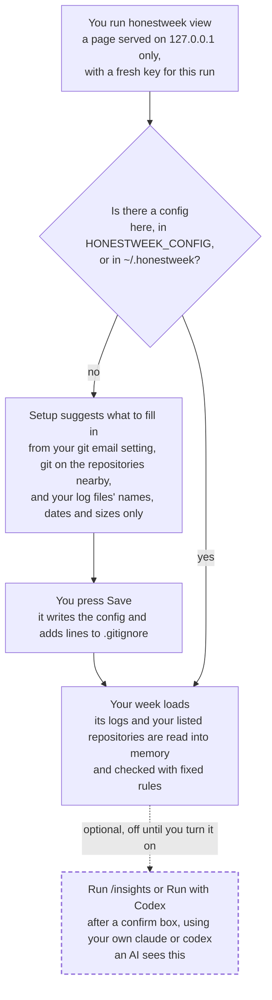
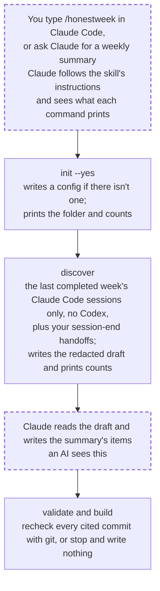

# Where your data goes

## In plain terms

honestweek reads your Claude Code and Codex session logs and your git repositories on your own machine, and most of what it does sends nothing anywhere. The `view` page, its Setup and Settings, and the `init`, `discover` and `build` commands all run with fixed rules on your computer. Session text reaches an AI in two ways. When you type `/honestweek` in Claude Code, or ask Claude for a weekly summary, Claude runs honestweek for you, so it reads a redacted draft of last week's Claude Code sessions to write the summary, and it sees whatever each command prints. If you run the skill in Codex instead, Codex sends the same draft and command output to OpenAI, or the endpoint your Codex is set to use, in Claude's place. On the `view` page, two optional buttons can hand your sessions to Claude or OpenAI, but only after you turn on Include /insights, press one and confirm. Here I walk through both paths, list exactly what the draft holds, and say who receives what.

A few terms used below:

- A **session** is one conversation log from Claude Code or Codex. Codex is OpenAI's coding agent.
- **Redacted** means honestweek has swapped private text for a marker such as `[redacted:email]` before anything else reads it.
- A **display-only** repository is one your config marks `display`. honestweek never runs git in it, and its sessions are kept private.
- Your **config** is `honestweek.config.json`, the file that lists your email, your repositories and the private words to hide.
- The **skill** is the set of instructions Claude follows when you type `/honestweek`, or when you ask it in words for a weekly summary, weekly update or work report. A scheduled task can start it too.
- The **find skill** is a second, read-only set of instructions that Claude or Codex can start on its own when you ask about past sessions: which session made a pull request, what happened in one, where sessions went wrong.
- **Include /insights** is a switch on the `view` page that lets its two AI buttons run. It's off until you turn it on.
- **Your plan** is your own Claude or OpenAI subscription, which those programs sign in with.

## At a glance

| What you run | What it reads | Does an AI see it? |
| --- | --- | --- |
| `honestweek view` (the page, with its Setup and Settings) | Your session logs and repositories, into memory on your machine | No, unless you turn on Include /insights and press Run |
| `/honestweek` (the weekly summary in Claude Code) | A redacted draft of last week's Claude Code sessions, plus what each command prints | Yes: Claude reads all of it and writes the summary from the draft |
| `find`, `replay`, `problems`, `goals`, and the find skill | Your session logs, goal list and repositories, into memory on your machine | Only when an agent runs them: it reads what they print, redacted the way the page shows it |
| `init`, `discover`, `build` on their own | Your git settings, repositories and logs | No. Run through `/honestweek`, Claude sees what they print |

## `honestweek view`: nothing goes to an AI unless you ask

Boxes with a dashed border are the steps where an AI sees your sessions.

Step by step:

1. **You run `honestweek view`.** It serves a page on `127.0.0.1`, so only your own machine can reach it. Each run makes a fresh key, and the page answers data requests only from a tab that holds it.
2. **Setup suggests what to fill in**, when there's no config here, in `HONESTWEEK_CONFIG` or in `~/.honestweek` yet. It asks git for your email setting, and runs git in this folder and the folders next to it to see which are repositories you've committed to and when their last commit was. It looks at your log files' names, last-change dates and sizes to say how much history there is, without opening them.
3. **You press Save.** It writes the config, an example config if there isn't one, and the lines that keep honestweek's private files out of git in `.gitignore`. If you pick "Save it for: Every folder", the config and that `.gitignore` go in `~/.honestweek` instead, with no example config.
4. **Your week loads.** honestweek reads the logs in the window you chose (how many days back the page looks) into memory, runs git in the repositories your config lists (never in a display-only one), and checks it all with fixed rules. The page shows redacted text. Its Show private text switch shows your private words on your own screen only. Settings can also look for repositories in this folder and the folders next to it, as Setup does, and checks that git doesn't track your config here.
5. **Optional: results saved between runs.** With Save results between runs on in Settings (off until you turn it on), each time a whole window loads, `view` writes what the Problems checks found, and each day's history unless you turn that off, to `honestweek.saved/` beside your config: one file per day, with private words hidden, readable only by you and git-ignored. A later run shows a session whose log is gone from it, marked saved. It never saves private text, a log's own session id (only a hash of it) or a log's path (only a hash of that). A hash can't be turned back into what it hides, but anyone holding the folder could check a guess against it (a guessed repository name, say), which is one more reason it's readable only by you. `honestweek problems --session` reads it for a session outside the dates you ask about, and redacts it again with your current private words first. Forget saved results in Settings deletes the folder. No AI sees any of it.
6. **Optional: Run /insights or Run with Codex.** Both stay off until you turn on Include /insights, on the Problems page or in Settings. Each asks you to confirm first, then starts your own `claude` or `codex`. [Who receives what](#who-receives-what-from-the-two-run-buttons) says what each one sends.

## `/honestweek`: where an AI reads your sessions

The skill in Codex works the same way, with Codex in place of Claude, sending the draft and command output to OpenAI, or the endpoint your Codex is set to use.

Step by step:

1. **You type `/honestweek`, or ask Claude for a weekly summary.** Claude follows the skill's instructions. With no config anywhere, it stops and asks you before `init` writes one. Then it runs honestweek's commands on your machine. The first is `honestweek status`, run as the skill starts, which prints the config's path, the last completed week's dates and time zone, the names of the step files with their counts and states, when the output was built, and the next step, never an item's text, anything from a session, or the contents of a config it can't read. Claude sees what each command prints, and Claude Code sends that to Anthropic like anything else in your session.
2. **`init --yes`** runs only when there's no config anywhere and you've said yes; with one, the skill skips it. It writes a config if the folder doesn't have one, and leaves an existing one alone. `init --user` writes `~/.honestweek/honestweek.config.json` instead. Its first line names the folder it's working in. Its summary gives counts: how many repositories it found and the files it wrote, not your email or the repositories' names. If a display-only conflict stops it, the reason names the folders involved.
3. **`discover`** reads the Claude Code sessions that started during the last completed week (Monday to Sunday, in UTC) and hold at least one prompt you typed, not Codex. It adds the session-end handoffs (notes saved at the end of a session in a repository's `.claude/handoffs/` folder) from repositories your config doesn't mark display-only. It writes the redacted draft, `honestweek.draft.json`, and prints counts and the week's dates. If it can't read a repository's history, the message names that repository's folder.
4. **Claude reads the draft and writes the items**, the lines of your summary, into `honestweek.items.json`. This is where an AI sees your session text: everything in the draft, listed in the next section. With the plugin installed, Claude hands this step to its distiller, a helper with file tools only (no shell, no web), so text in the draft can't make it run a command or open a page. It can still write files, and it's told to write only the items file. The distiller is Claude too, so the draft still goes to Anthropic the same way.
5. **`validate` and `build`** check the items and recheck every commit they cite against git. If one doesn't resolve or isn't yours, `build` stops and writes nothing. Claude then shows you the result, and you decide whether to publish it.

Every command also prints one line on stderr naming the config it read by its full path (the one in the folder it runs in, else the file `HONESTWEEK_CONFIG` names, else `~/.honestweek/honestweek.config.json`), and the folder its files go in when that isn't the folder it ran in. Claude sees that line too. The draft, the items and every other file a command writes go beside that config.

With the `page` or `site` output, the skill can also run `digest prepare`, which picks a few items from your Claude Code and Codex sessions with fixed rules: prompts, ideas, techniques, decisions, reversals and next steps. The picks that pass its privacy check, redacted, go into the built page, and Claude reads that page when it shows it to you. So with these outputs an AI also sees those picks, Codex ones included.

The skill can also run `mine`, which looks for solved problems across all your logs. Claude sees what it prints: counts and dates, the first 80 characters of a simplified, redacted error line for each of up to eight findings, and a drafted post's file path and title.

## What the draft holds

The draft has the week's start and end dates, one entry per session, the handoffs, and a note telling Claude that every string is already redacted and must be summarized, never copied. The names in brackets below are the field names, if you open `honestweek.draft.json` yourself. For each session in a repository your config lists, the entry holds:

- **Which session:** the first eight characters of its id (`id`), the day it started in UTC (`date`), and your config's name for its repository (`project` and `repo`).
- **What you typed:** your first 60 prompts, each cut to 280 characters (`steers`), plus a second copy, cut to 160 characters, of up to 30 prompts that read as a change of direction, such as one starting "no" or "actually" or containing "instead of" (`redirects`). These can include prompts after the first 60.
- **What Claude said:** up to 80 notes in all, each cut to 400 characters (`assistantNotes`): its text replies to you and, on models that put their progress notes in their reasoning, the reasoning note right before each tool call.
- **What it did:** how many times each tool was used; the files it touched, as up to the last two of their folder names under the folder the session started in, plus their extension, such as `src/*.mjs`, never a file name (a file outside that folder shows only its extension); which test runners it ran, from a fixed list such as `node --test` or `pytest`; and the kinds of searches it made, such as `grep` or `glob:*.md`, not what it searched for (`toolSignal`).
- **How tool runs went:** for up to 80 tool results, one of three words, pass, fail or build-broke, matched from the result's text (`statusSignals`).
- **Commits:** the commits you made in that repository that week on its current branch, each with its id, date and redacted message subject, plus up to 40 more that the session's own git commands printed, which carry only their id and the day the session saw them (`candidateCommits`).

A session in a display-only repository, or in a folder your config doesn't list, arrives as an empty shell: its short id, its date, the word "private", and nothing else. From each handoff, the draft adds its tagged claims, reversals and the commits it cites.

**What's hidden.** Before `discover` writes the draft, every string passes the redactor, which hides email addresses, folder paths under your home folder (on Linux, macOS and Windows), passwords, tokens, API keys, ids and other secrets in the shapes it knows, runs of nine or more digits such as account numbers, money amounts, and the people's names, codenames and client words you listed in your config.

**What isn't.** A name or client word you didn't list shows as written, and so does a secret in a shape the redactor doesn't know. What the work was about stays in plain words, since that's what the summary is made from. [What the scrubber catches, and what it doesn't](../README.md#what-the-scrubber-catches-and-what-it-doesnt) has the details, and Settings' Suggest words from my sessions lists names you might want to add.

## Who receives what from the two Run buttons

| Button | What runs | What it's given | Who receives it |
| --- | --- | --- | --- |
| Run /insights | Your own `claude -p /insights`, Claude Code's own report on your sessions | Nothing from honestweek. Claude Code's /insights reads your Claude Code sessions itself, including ones in display-only repositories and folders your config doesn't list, so honestweek doesn't choose or redact what it reads. | Anthropic, or the Bedrock, Vertex or gateway your Claude Code is set to use, on your plan |
| Run with Codex | Your own `codex`, in its read-only sandbox (a limit that stops it changing files), from an empty folder, keeping no log of its own | Up to 10 Codex sessions a run that it hasn't judged yet: ones in the window that you started, in a repository your config lists and doesn't mark display-only. Each goes as a condensed text, with every string redacted: your prompts, its replies and the command or file each step named, not the steps' output, cut to 60,000 characters. | OpenAI, or the endpoint your Codex is set to use, on your plan |

Both work only while Include /insights is on, and each asks you to confirm first. Each program gets only the environment variables it needs to start and sign in, not your other tokens. Codex's read-only sandbox can't change files, but it can still read any file you can read. The page shows part of what comes back for the sessions in your window, apart from honestweek's own counts, labelled as written by an AI.

## The find skill and its four questions

`find`, `replay`, `problems` and `goals` answer the questions the page does and print the answer. Run in a terminal, nothing reaches an AI. When Claude or Codex runs them, through the find skill or because you asked, it reads what they print: session titles, your prompts and step descriptions, file names and findings, redacted the way the page shows them with Show private text off. They have no option for private text, and they write nothing to disk, apart from `--demo`'s made-up week, which goes in a temporary folder they remove.

In Claude Code, the find skill lets Claude run those four without asking each time, and nothing else: starting the page for a link (`view`) asks you first, and it never runs `init`, `build` or anything that writes. In Codex, the skill tells it the same, but your Codex approval settings decide what it runs without asking, and the same text goes to OpenAI's model instead of Claude.

## What honestweek itself sends

Nothing. honestweek has no telemetry and makes no network calls. Its two local servers, `view` and `preview`, answer only on `127.0.0.1`. The steps above where an AI sees your sessions are Claude Code, `claude` and `codex`, programs you run on your own plan.

## Implementation detail

- The `view` server binds `127.0.0.1` and makes a fresh key per run: `lib/view/server.mjs`.
- Setup's suggestions: `createSetup` in `lib/view/setup.mjs`. The email comes from `inferAuthorEmail`, and the repository checks are `authorHasCommits` (`git log --author`) and `repoLastCommitAt` (`git for-each-ref`), all in `lib/init.mjs`. The log size comes from `historyInfo` and `logFiles` in `lib/view/window.mjs`, which use `readdirSync` and `statSync` only. Save calls `writeInitFiles` in `lib/init.mjs`. Settings: `createSettings`, wired in `lib/view.mjs`.
- `init`'s printed lines: the opening line and `foundLine` in `runInit`, `lib/init.mjs`; a display-only conflict's message comes from `checkDisplayOverlap` and `checkNestedRoles` in `lib/repo-identity.mjs`.
- The draft: `lib/discover.mjs` (`mergeCandidateCommits`) and `lib/claude-adapter.mjs` (`adaptOneSession`, `extractEntry`, `handleToolUse`, `reducePath`, `detectTest`, `deriveStatus`, `extractCommits`, `privateEntry`, and the limits `MAX_STEERS`, `MAX_STEER_LEN`, `MAX_NOTES`, `MAX_NOTE_LEN`, `MAX_REDIRECTS`, `MAX_STATUS`, `MAX_CANDIDATES`). The week: `lib/resolve-week.mjs`. Handoffs: `lib/handoffs.mjs`. The redactor: `lib/redact.mjs`.
- `mine`'s printed lines: `lib/mine.mjs`.
- The distiller: `agents/honestweek-distiller.md`, which Claude Code finds in the plugin's `agents/` folder. The contract it preloads: `skills/honestweek-contract/SKILL.md`, listed under `skills` in `.claude-plugin/plugin.json`.
- Saved results: `lib/saved/store.mjs` (the folder, its modes, pruning and Forget), `lib/saved/checks.mjs` (what a day's file holds, `redactSaved`, `findSaved`, `savedSessionAnswer`), `lib/saved/history.mjs` (`saveHistory`, `loadSaved`) and `lib/saved/saver.mjs`, called from `checkedReady` in `lib/view/data.mjs`. What a saved session holds, and what it leaves out: `exportSession` in `lib/replay/saved-sessions.mjs`.
- Run /insights: `lib/view/insights.mjs` (`CLAUDE_ENV`, `CLAUDE_PREFIXES`). Run with Codex: `lib/view/codex-judge.mjs`, whose fixed arguments are `CODEX_ARGS` and whose text is built by `sessionText`; which sessions it judges is `judgedSessions` in `lib/view/data.mjs`. The confirm boxes: `lib/view/assets/insights.js`.
- Which config a command reads, and its stderr line: `findConfig` and `configLine` in `lib/config-lookup.mjs`.
- The skill's rules and its flows: `SKILL.md`, and the weekly steps in `flows/weekly.md`.
